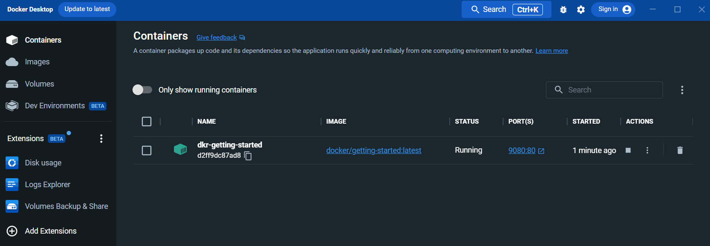

# Prerequisites

To attend this workshop you will need the following:

- A windows, mac or linux computer with : 
    - As docker uses quite a lot of memory, it is recommended to have at least 16Gb of Ram, but you will be able to complete the workshop with 8gb.
    - Enough free space to store container images and instances. Recommended to have at least 15Gb of available space. Database containers particularly can sometimes be quite large.
- A working Docker engine installation. 
    - The simplest way to do this is using [Docker Desktop](https://docs.docker.com/get-docker/).
    - For linux, if you prefer running a full docker instance, there are installations which are distro specific available [here](https://docs.docker.com/desktop/linux/install/).

This guide is primarily focused on Windows and Mac development, but will work for Linux just as well. 

## SDK

Check the version of the .NET SDK you have installed using the following command:

    dotnet sdk check

This workshop will require version 8.0 of the SDK, preferrably the latest version available. If you need to download the SDK, you can do so from [https://dotnet.microsoft.com/en-us/download/visual-studio-sdks](https://dotnet.microsoft.com/en-us/download/visual-studio-sdks).

## Test your Docker installation

It's important that your docker installation is working before you attend the workshop. To test that you can run the following command on your terminal.

    docker run --name dkr-getting-started -d -p 9080:80 docker/getting-started 

This will run the default 'getting started' container in port 9080. You can then access the container at http://localhost:9080 when it is running. If it is successful, you will see the following in your docker desktop application 

**PLEASE NOTE** : The reason this is not using the standard port 80 is that a lot of web developers on Windows will have IIS running on port 80. This will cause issues when trying to access the container.

This will mean that when you browse the site at http://localhost:9080 the details there will be slightly different, and will refer to port 80 in the guide, but in reality you are running this on port 9080

If your local port 9080 is used for something else, you can choose any other port number instead by changing the value in this argument : -p **9080**:80
