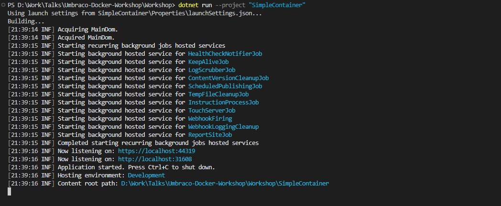
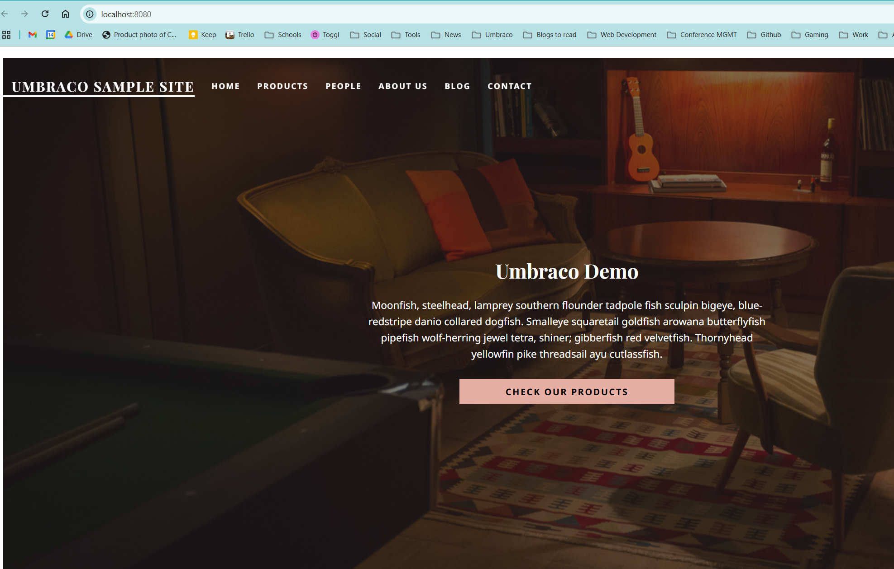

# Simple Umbraco Container

In this introduction exercise, we will create a simple Umbraco container that runs locally on your machine. It will be a completely standalone container, but will allow us to understand the basics of how to run Umbraco in a container, how to build a container image, and how to run it.

This exercise will cover the following steps:
1. Set up the Umbraco website using the .NET CLI.
2. Create a Dockerfile to build the Umbraco site into a Docker image.
3. Build the Docker image using the Docker CLI.
4. Run the Docker container locally to test the Umbraco site.

This exercise is designed to introduce you to the concepts and is not intended to be a production-ready solution, but is a good starting point for learning how to work with Umbraco in a containerized environment. It will use SQLite as the database, which is suitable for development and testing purposes.

## Set up the Umbraco Website

Firstly ensure you are in the **/Workshop** folder in your terminal window and run the following command to create a new Umbraco site. 

```bash
dotnet new install Umbraco.Templates::13.9.1 --force

dotnet new sln --name "SimpleContainer"
dotnet new umbraco --force -n "SimpleContainer"  --friendly-name "Administrator" --email "admin@example.com" --password "1234567890" --development-database-type SQLite
dotnet sln SimpleContainer.sln add "SimpleContainer"

dotnet add SimpleContainer package Umbraco.TheStarterKit --version 13.0.0
```

This will create a new Umbraco site in a folder called `SimpleContainer`, with the administrator user set up and the Starter Kit installed. It's using the SQLite database for simplicity.

## Run the Umbraco Site Locally

Before we proceed with Docker, let's ensure that the Umbraco site runs correctly on your local machine. You can do this by running the following command in the terminal:

```bash
dotnet run --project "SimpleContainer"
```

You should see the familiar Umbraco Sample Site running with the starter kit installed, check the output of the terminal window to see which port to access the site on.




## Create the Dockerfile

Next, we will create a `Dockerfile` in the `SimpleContainer` folder. This file will contain the instructions to build the Docker image for our Umbraco site.

Create a file called `Dockerfile` in the `SimpleContainer` folder and add the following content. The case of the file name is important, it must be `Dockerfile` with a capital "D".

```dockerfile
# Use the SDK image to build and publish the website
FROM mcr.microsoft.com/dotnet/sdk:8.0 AS build
WORKDIR /src
COPY ["SimpleContainer.csproj", "."]
RUN dotnet restore "SimpleContainer.csproj"
COPY . .
RUN dotnet publish "SimpleContainer.csproj" -c Release -o /app/publish

# Copy the published output to the final running image
FROM mcr.microsoft.com/dotnet/aspnet:8.0 AS final 
WORKDIR /app
# Set the environment to Development, so that Umbraco loads the connection string from the appsettings.developement.json file
ENV ASPNETCORE_ENVIRONMENT=Development
# Expose the port that Umbraco will run on
ENV ASPNETCORE_URLS=http://+:8081
# Expose the port that the application will run on
EXPOSE 8081

# Copy the published output to the final running image
COPY --from=build /app/publish .

# Copy the media items to the final running image
COPY ./wwwroot/media ./wwwroot/media

# Set the entrypoint to the web application
ENTRYPOINT ["dotnet", "SimpleContainer.dll"]
```

TODO : Desribe what each line of this file does. 

## Build the Docker Image
Now that we have the Dockerfile set up, we can build the Docker image. Make sure you are in the `SimpleContainer` folder and run the following command:

```bash
docker build -t simplecontainer ./SimpleContainer
```

This command will build the Docker image using the Dockerfile in the `SimpleContainer` folder and tag it as `simplecontainer`. The build process will take a few moments as it downloads the necessary base images and builds the Umbraco site.

## Run the Docker Container

Once the image is built, you can run the Docker container using the following command:

```bash
docker run -d -p 8080:8081 --name simplecontainer simplecontainer
```

Once the container has started up, you should be able to access the Umbraco site by navigating to `http://localhost:8080` in your web browser. It will take a few moments for the container to start up and for Umbraco to initialize.




### Run a New Instance on a Different Port

You can start another instance of the container on a different port by changing the left side of the port mapping. For example, to run on port 8082:

```bash
docker run -d -p 8081:8081 --name simplecontainer2 simplecontainer
```

Now, you can access the new instance at `http://localhost:8082`. 


### Stop and Remove the Running Container

To stop the new running container, use:

```bash
docker stop simplecontainer2
```

To remove the stopped container (optional):

```bash
docker rm simplecontainer2
```

One thing to note is that these two containers are completely independent of each other. They do not share any data, media or files, and any changes made in one container will not affect the other. The only thing they have in common is the Docker image they were created from, which is `simplecontainer`. This is a key feature of containerization, as it allows you to run multiple instances of the same application without them interfering with each other.

## Summary

**Key things we did in this exercise:**

- Created a new Umbraco site using the .NET CLI and installed the Starter Kit.
- Configured the site to run on a specific port for containerization.
- Wrote a Dockerfile to build and run the Umbraco site in a container.
- Built a Docker image for the Umbraco site.
- Ran the Umbraco site in a Docker container and accessed it via the browser.
- Started additional container instances on different ports.
- Stopped and removed containers as needed.

### Next Step

Now that we have a simple Umbraco container running, the next step is to set up a database container that our Umbraco site can connect to. This will allow us to store content and media in a more robust way than using SQLite. Open [3-Database-Container](3-Database-Container.md) to continue.