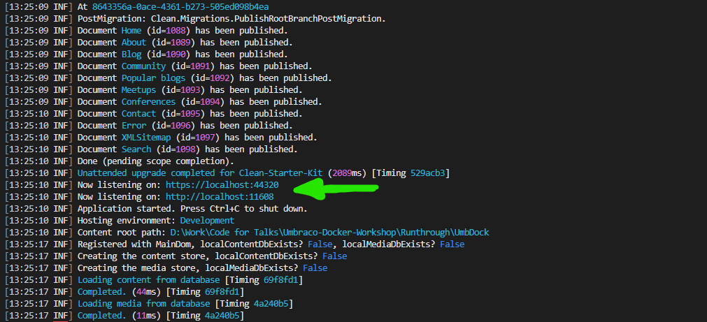

# Exercise 4. Creating the basic Umbraco Editor Site Container

We are going to create our Umbraco website running locally on your machine natively, and connected to the database container we just created.

## 4.1 Installing Umbraco Template and start Website

***Action:*** Create a new Umbraco site using the following command. This will define the name of the site and the default database, as well as the default admin user and password. 

```bash
dotnet new umbraco -n UmbWeb --friendly-name "Admin User" --email "admin@admin.com" --password "1234567890" --connection-string "Server=localhost;Database=UmbracoDb;User Id=sa;Password=SQL_PassW0rd@1234;TrustServerCertificate=true"
```

### Create the SLN file and Starter Kit

Run the follwowing command to create the solution file for the Umbraco site. Run the following command in the **/Workshop** folder. This will create a new solution file and add the Umbraco project starter kit template.

```bash
# Create a new solution file for the Umbraco site
dotnet new sln --name "Umbraco-Docker-Workshop"
dotnet sln Umbraco-Docker-Workshop.sln add "UmbWeb/UmbWeb.csproj"

# Add the Umbraco StarterKit package to the project
dotnet add UmbWeb package Umbraco.TheStarterKit --version 13.0.0
```

## 4.2 Start the Umbraco Website

***Action:*** Run the website by issuing the following command. This will start the website using Kestrel, and connect to the database server in the container.

```bash
dotnet run --project UmbWeb
```

This should, if there are no errors, start up the website for you to browse.



If you browse the site at https://localhost:11608 (or whatever port your computer reports - it may vary) you should be able to see the site running. You can also access the Umbraco backoffice at https://localhost:11608/umbraco using the credentials below.

- Username : admin@admin.com
- Password : 1234567890

This will illustrate that developing with Umbraco in a container is very similar to developing with Umbraco natively, and that you can run the site locally on your machine without needing to use Docker. Once we have the site setup and running, we will then look at how to containerize the site and run it in a Docker container.

## Next Steps

Let's put that website in a container - open [5. Website Container](5-Website-Container.md) to do this.

