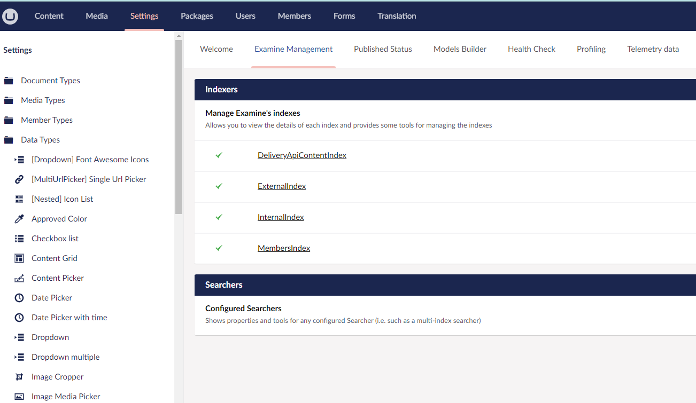
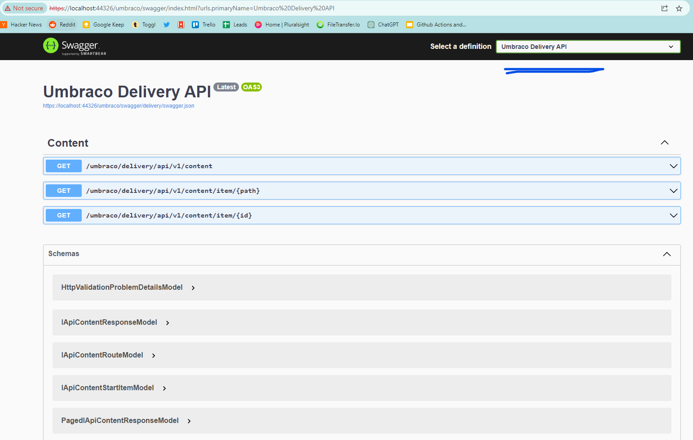

# Exercise 6. Adding an API to the site

We will use the Umbraco Content Delivery API to add an API to the site.

## 6.1 - Build Index for Content API

Now that there is a site and database running, we will use the new content delivery API. First we need to enable the API by adding the following to appsettings.json under Umbraco > CMS

```json
    "DeliveryApi": {
            "Enabled": true,
            "RichTextOutputAsJson": false
    }
```

## 6.2 - Enable CORS Policy to allow access to the API

We will also need to enable CORS to allow access to the API. To do this, we will add the following to the start of the services in Program.cs

```csharp
    // Add CORS policy for workshop/demo (allow all)
    builder.Services.AddCors(options =>
    {
        options.AddPolicy("AllowAll", policy =>
        {
            policy.AllowAnyOrigin()
                .AllowAnyHeader()
                .AllowAnyMethod();
        });
    });
```

You will also need to start that CORS Policy in the Startup.cs Configure method

```csharp
// Use CORS before Umbraco middleware
app.UseCors("AllowAll");
```


## 6.3 - Rebuild the image and run it

You will need to rebuild the umbWeb docker image and run it again to see the changes. You can use the following to do that

```bash
docker build -t umbweb:latest ./UmbWeb
```

Stop and remove the previous running umbweb container. You can also do this in the Docker Desktop app by right-clicking the container and selecting "Stop" and then "Remove".


```bash
docker stop umbweb
docker rm umbweb
```


Run the new version of the umbweb image

```bash
docker run --name umbweb -p 8000:8081 -v umb_media:/app/wwwroot/media -v umb_logs:/app/umbraco/Logs -e ASPNETCORE_ENVIRONMENT='Staging' --network=umbNet -d umbweb
```    


## 6.4 - Rebuild the Index and test the API

You will need to log in to Umbraco and rebuild the index to ensure the API is working. You can do this by going to the following url: [http://localhost:8000/umbraco](http://localhost:8000/umbraco)

Use the credentials below :

- Username : admin@admin.com
- Password : 1234567890

You can then navitage to Settings > Examine Management > DeliveryApiContentIndex and rebuild that index.



Open the site at the url http://localhost:8000/umbraco/swagger/index.html and in the top dropdown, select the "Umbraco Delivery API". You should be able to test the content API to ensure it is working.




If you'd like to see more info about the Content delivery API, please read the docs : [https://docs.umbraco.com/umbraco-cms/v/12.latest/reference/content-delivery-api](https://docs.umbraco.com/umbraco-cms/v/12.latest/reference/content-delivery-api)

## 6.5 Testing the Product API

To test the API, you can simply call a url like the following url, which returns all documents of type "Product": [http://localhost:8000/umbraco/delivery/api/v1/content?filter=contenttype%3Aproduct](http://localhost:8000/umbraco/delivery/api/v1/content?filter=contenttype%3Aproduct)

This should return a JSON collection of Post Summaries in a collection, which we will use with the Blazor App. If you would like to know more about the API, you can read the documentation here: [https://docs.umbraco.com/umbraco-cms/13.latest/reference/content-delivery-api](https://docs.umbraco.com/umbraco-cms/13.latest/reference/content-delivery-api)

## 6.6 Running a 2nd instance of the website container

While the website container has the API running, we want to spin up a 2nd instance of the website container. This will simulate a load-balanced environment. 

*Note : By using the same volumes for media and logs, both containers will share the storage on the docker host, and thus the media library and logs will be shared between the containers. However this is NOT enough to run a load balanced container in production - this is to separate the content entry and content delivery nodes in this demo.*

***Action:*** Run the following command to start the 2nd container.

```bash
    docker run --name umbweb2 -p 8001:8081 -v umb_media:/app/wwwroot/media -v umb_logs:/app/umbraco/Logs -e ASPNETCORE_ENVIRONMENT='Staging' --network=umbNet -d umbweb 
```

You can browse this container by visiting the following URL: [http://localhost:8001/](http://localhost:8001/).

    
With multiple website containers running, your Docker Desktop instance will look similar to the following:


