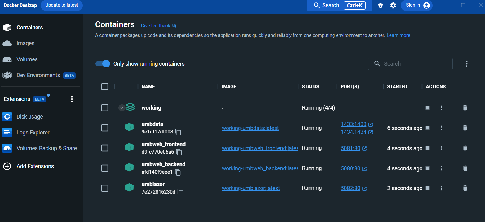

# 8 Docker compose

So far we have created all our containers manually which is fine, but we want to make this repeatable. In this part we will use Docker compose to deploy all containers together, and to configure the network between them. This will use the Production profiles of the various projects.

Docker compose is a tool for defining and running multi-contianer applications including :

- Names of each of the containers (called Services in Docker compose)
- The networks each container connects to
- The volumes used by each container
- The ports exposed by each container
- Environmental variables configured for each container

This single file represents the entire application, and can be used to deploy the application to any environment.

## 8.1 Create the Docker Compose file

I've prepared a single docker compose file to complete this application To prepare the application for deployment with Docker compose:

***Action:*** Copy the following files:

- Copy **/Files/docker-compose.yml** to **/Workshop/docker-compose.yml**
- Copy **/Files/UmbWeb/appsettings.Production.json** to **/Workshop/UmbWeb/appsettings.Production.json**
- Copy **/Files/UmBlazor/wwwroot/appsettings.Production.json** to **/Workshop/UmBlazor/wwwroot/appsettings.Production.json**

These will configure the application to use the production profiles, and will also configure the connection strings for the databases, which will be used when we run the application as single distributed application.

## 8.2 Run the Docker Compose file

Before we run the application, we need to delete all existing running containers so that any ports they are using are freed up. This is important as we will be using the same ports for the new containers we will create with Docker Compose.

**Action :** Run the following command in your terminal:

```bash
docker stop umblazor umbweb umbweb2 umbdata
```

Verify that none are running by looking at the Docker Desktop app, or by running the 'docker ps' command. Once all running containers have been deleted, we can run the Docker Compose file.


**Action :** Start all containers using the following command:

```bash
docker compose up -d
```

This will first buuld and then start all the containers from the images we have just built, and if you open Docker Desktop, you should see all the containers running.



Once these are up, we can browse the umbraco websites using the following URLs

- Umbraco 1 : http://localhost:5080/ 
- Umbraco 2 : http://localhost:5081/
- Blazor : http://localhost:5082/

To stop and remove the containers, run the following command:

```bash
docker-compose down 
```

## Next Steps 

Now we've gone through the exercise, let's draw our conclusions [9. Conclusion](9-Conclusion.md). There's also a guide for the Docker CLI [10. Docker CLI Quick Start](10-Docker-CLI-Quick-Start.md).