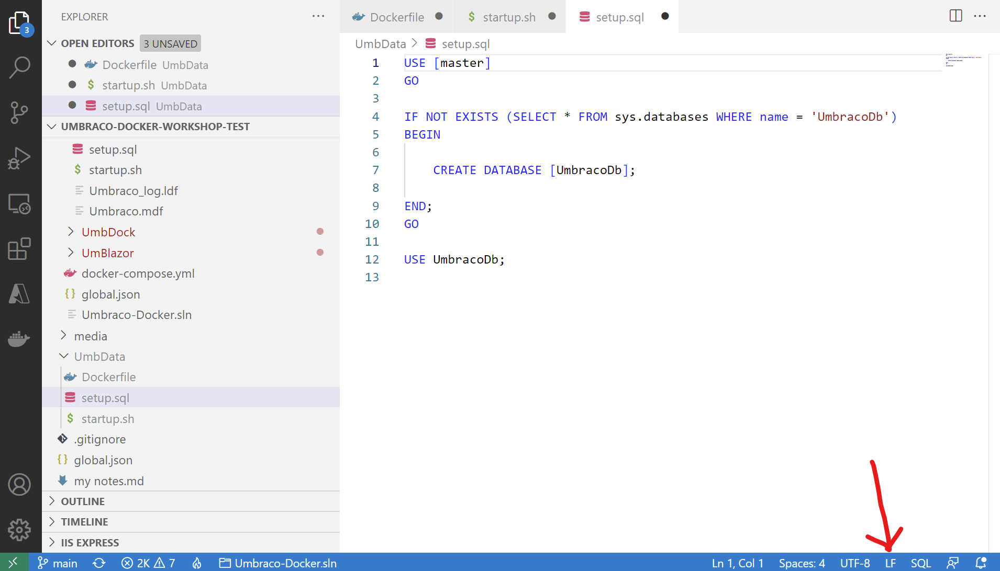
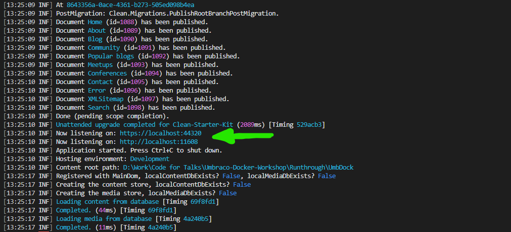
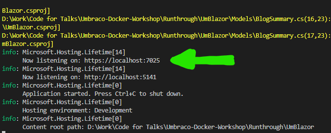
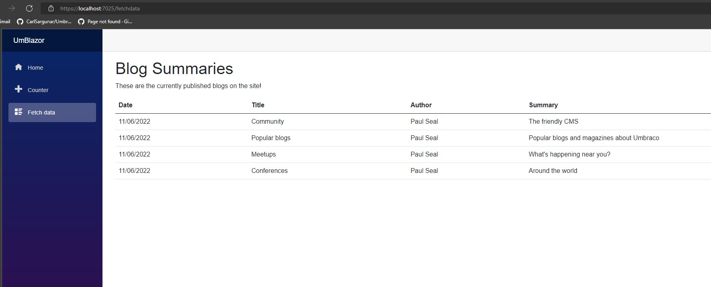

# Umbraco and Docker

## Prerequisites

In order to participate in this workshop you will need to ensure you have the full list of prerequisites, please see the [prerequisites](Prerequisites.md) document for details.

# Slides : What is a container?

Before we start the next stages we will look at the following concepts. The link to the slides used throughout this presentation is https://docs.google.com/presentation/d/1MYf3CkzKYx-vZS0ntKIbNPejYVDbU2iPQit1OTzsoUM/

- What is a container?
    - Virtual machine vs Docker container
    - Components of a container
    - Docker container vs. Docker image
    - Describe Dockerfile

# Tools and Set-up

During this workshop it is recommended that you use Visual Studio Code to run the workshop, and that you have the Auto-save feature enabled. To do this, go to the **File** menu, and select **Autosave**.

Where commands are executed, you should be using the built in terminal from VS Code, and not the command line. To open the terminal, select **View**, then **Terminal**.

It's recommended the first step is to fork this repository on Github so you can have your own copy of it and then clone it onto your machine. If you don't have a github account, you can download a zip of this repository and extract it to your machine.

These instructions are also available on the [GitHub repository](https://github.com/CarlSargunar/Umbraco-Docker-Workshop/blob/main/Workshop.md) or your own fork.

Wherever there are something for you to do I will add the flag **Action:**. This will indicate to you that you should do the action described in the instruction.

During the workshop please take extra care to make sure you have the right path according to the instructions. There are a lot of similarly named files and folders, and you will need to be careful to not mix them up.

## Working Folder

**Action:** Create a folder in the root of your application called Worhshop. In your terminal window, change directory to the **Workshop** directory. All exercises will be completed in this folder.

The folders which are in this workshop are : 

- **Files** - This folder contains pre-created files which will be used in this workshop to save you typing everything out manually
- **Media** - The images used in this workshop are stored in there
- **Workshop Complete** - This folder contains a fully complete version of the workshop which can be used for reference in case you run into problems, in a zipped up file. No cheating!!
- **Workshop** - This will be the folder where the workshop is being run from.

# Exercise 1 - Create a Database Container

The first step is to create a database container which will host our database for the Umbraco sites going forward in this workshop. We are deliberately not using SQLite or LocalDB as these aren't universally compatible across all platforms.

## 1.1 Create a container for the database server

**Action:** 
- In your working folder, create a new folder called UmbData. 
- In that folder, create a blank file in the UmbData folder called Dockerfile. 

This will folder and the associated Dockerfile will define the database container, the image to use, and the ports it exposes and also describe the configuration we will use with that database container. 

*Note : the case of the file is important - it needs to be called Dockerfile with no extension*

**Action:** Paste the contents below in that file, and make sure the line endings are **LF**.

    FROM mcr.microsoft.com/azure-sql-edge:1.0.4

    ENV ACCEPT_EULA=Y
    ENV SA_PASSWORD=SQL_password123

    USER root
    
    ENV MSSQL_BACKUP_DIR="/var/opt/mssql"
    ENV MSSQL_DATA_DIR="/var/opt/mssql/data"
    ENV MSSQL_LOG_DIR="/var/opt/mssql/log"

    EXPOSE 1433/tcp

    COPY setup.sql /
    COPY startup.sh /

    ENTRYPOINT [ "/bin/bash", "startup.sh" ]
    CMD [ "/opt/mssql/bin/sqlservr" ]   

*Note : We are use Azure SQL Edge here as a database container in case there is anyone using a Macbook with an M1 chip as these run on the Arm architecture.*

There are 2 other files created in this repository which we need to copy into the UmbData folder.

**Action:** Copy these files:

- From /Files/UmbData/setup.sql to /Workshop/UmbData/setup.sql
- From /Files/UmbData/startup.sh to /Workshop/UmbData/startup.sh

These two files will be used to create a blank database if none exists when the database container starts. That way when the website starts it will already have a blank database ready to use, but if the database already exists it won't re-create it. 

## 1.2 Windows vs Linux Line Endings

**Action:** Once all 3 files are in the UmbData folder, make sure they all have the correct Line Endings, that they are terminated with Line Feed (LF) and NOT Carriage Return Line Feed (CRLF).

In VS Code, this can be done using the option as shown below.

If it shows CRLF, click on the label and at the top you can change it to LF.

Historically windows terminates line-endings in file with a carriage return and line feed (CRLF), while Linux uses a single line feed (LF) - and if you want to learn about the history of why then check out this awesome video from Scott Hanselman : [https://www.youtube.com/watch?v=TtiBhktB4Qg](https://www.youtube.com/watch?v=TtiBhktB4Qg)

## 1.3 Build the database image and run the database container

All our files are ready to build the database image and run the database container, so that's the next step.

*Note : If you are running a local SQL Server on your machine, or any other process listening on port 1433, you will need to stop that process before you can run the database container, or the container will not be able to start.*

**Action:** 

In your terminal window build the database image with the following command:

    docker build --tag=umbdata ./UmbData    

Once the image is built, run it with the following command. 

    docker run --name umbdata -p 1433:1433 --volume sqlFiles:/var/opt/mssql  -d umbdata

This should give you a container ID back if the container was started successfully. 

## 1.4 Creating the network for our containers

To let the website and database containers communicate with each other, we need to define a custom bridge network between the two of them. 

**Action:** Run the following command in the terminal window to create a new Bridge network for our containers to use. 

    docker network create -d bridge umbNet    

We then need to run the database and website containers attached to this network. Since the database container is already running, we can issue the following command to attach the container to the network.

    docker network connect umbNet umbdata

You can inspect the network by running the following command.

    docker network inspect umbNet

Todo : Image

## Connecting to the database container

To test that your container is running Ok, you may want to test connecting to the server. You can connect with Sql Server Management Studio, LinqPad, or the Visual Studio Code SQL Server extension using the following credentials

- Host : Localhost
- Username : sa
- Password : SQL_password123
- Port : 1433

# 2. Creating the basic Umbraco Site

Now that we have a database container running, we are going to create our Umbraco website. We will create it first as a normal website running on the file system, and not in a container. 

**Action:** Create a folder called UmbWeb in the Workshop folder

## Installing Umbraco Template and start Website

**Action:** Run the following in the terminal to install the umbraco template.

    dotnet new -i Umbraco.Templates::10.0.0

**Action:** Set the SDK Version being used and Create solution/project. This will create a global file with the current latest version of the SDK, and a blank solution which you can use with Visual Studio if you prefer to use that.

    dotnet new globaljson --sdk-version 6.0 --force 

## 2.1 Start a new blank Umbraco Site

**Action:** Create a new Umbraco site using the following command. This will define the name of the site and the default database, as well as the default admin user and password. Here we will be using SQL LocalDB as the database so that in later steps it can be imported directly into the production database server. 

    dotnet new umbraco -n UmbWeb --friendly-name "Admin User" --email "admin@admin.com" --password "1234567890" --connection-string "Server=localhost;Database=UmbracoDb;User Id=sa;Password=SQL_password123;" 

## 2.2 Install a template site for the exercise. 

This workshop will use the Clean starter kit for Umbraco. This is a great starting point, and will let us focus on the docker integration while giving us a great site to work with. 

**Action:** Run the following command to install the Clean starter kit.

    dotnet add UmbWeb package Clean

**Action:** Run the website by issueing the following command.

    dotnet run --project UmbWeb

This should, if there are no errors, start up the kestrel server and serve the site for you to browse.

If you browse the site at https://localhost:11608 (or whatever port your computer reports) you should be able to see the site running.

## 3 Running the Umbraco Site in a container

Now that the Umbraco site is running through Kestrel but conneting to the database server in the container, we need to create a container for the Umbraco site. 

If the site is still running, stop it by running by pressing **Ctrl + c** in the terminal window. 

## 3.1 Create the Umbraco Site container

**Action:** In the Umbraco UmbWeb project create a Dockerfile to define the components of the Umbraco container. Paste the contents below in that file, and make sure the line endings are **LF**. 

    # Use the SDK image to build and publish the website
    FROM mcr.microsoft.com/dotnet/sdk:6.0 AS build
    WORKDIR /src
    COPY ["UmbWeb.csproj", "."]
    RUN dotnet restore "UmbWeb.csproj"
    COPY . .
    RUN dotnet publish "UmbWeb.csproj" -c Release -o /app/publish

    # Copy the published output to the final running image
    FROM mcr.microsoft.com/dotnet/aspnet:6.0 AS final 
    WORKDIR /app
    COPY --from=build /app/publish .
    ENTRYPOINT ["dotnet", "UmbWeb.dll"]

This Dockerfile starts with a build image which contains the SDK to actually compile the project, and one with ASP.NET runtimes to actually host the running application. The running application doesn't need any build tools, so we don't include them. From the above Dockerfile we can see the stages of the build process.

1. Starting on the main image, we will use the SDK image to compile the project.
2. Copying the working project folder to the build image
3. Run the restore command to download the dependencies
4. Compile and publish the output of the project
5. Switch to the hosting image and copy the published output to the final image
6. Set the entrypoint to the binary output of the main project

## 3.2 Modify the UmbWeb.csproj project file to include Media

**Action:** In order to include the media files which came with the template, in VS Code you need to add the following to the UmbWeb.csproj project file. There are several itemgroups in the file, so you can add this new section to the same level as those in any position of the file.

    <ItemGroup>
        <Content Include="wwwroot\media\**" />
    </ItemGroup>

Todo: Image of what it will look like after

## 3.3 Building the Umbraco Site image, setting a network and running it

Once the Dockerfile exists, we need to create a configuration which lets the website contianer connect to the database container. 

**Action:** Create a copy of the appsettings.Development.json called appsettings.Staging.json, and in that file ensure the connectionstring is set-up to connect to umbdata as a container name.

    "ConnectionStrings": {
        "umbracoDbDSN": "Server=umbdata;Database=UmbracoDb;User Id=sa;Password=SQL_password123;TrustServerCertificate=true",     "umbracoDbDSN_ProviderName": "Microsoft.Data.SqlClient"
    }

Todo: Image of what it looks like after

Finally we can compile a docker image for the Umbraco site. 

**Action:** Run the following command to build the image.

    docker build --tag=umbweb ./UmbWeb

This will download the required components and compile a final image ready to run the site in a container, and may take some time. However before we are able to run both the site and the database container, we need to set up the network. 

At this point we can see all the images we have created by using the following command

    docker images

## 3.4 Running the website container in the same network

We can then run the website container. Notice in the command below there is an argument to let the container know which network to connect to.

**Action:** Run the following command to run the website container.

    docker run --name umbweb -p 8000:80 -v umb_media:/app/wwwroot/media -v umb_logs:/app/umbraco/Logs -e ASPNETCORE_ENVIRONMENT='Staging' --network=umbNet -d umbweb

In the above command you can also see the volumes we use with the application container - specifically the log and the media folders. The reason to use these is that with media we want to share the media library if we should want to create more running sites (as we will later in the course) and with logs, we want to be able to view these logs and diagnose issues if the container isn't able to run for any reason.

One other thing we can see is the Environment variable we are passing the container with the -e flag, which sets our AspNetCore Environment to staging, and thus causes the container to run with the appsettings.staging.json file and allow us to connect to the database.

You can now see the website running by visiting:
    
    http://localhost:8000

Once the container is running, if you run a docker ps command, you'll see both the database and website containers running.

    docker ps

You can also see the status of running containers and logs by running the Docker Desktop application.

# Slides - Networks and Volumes

Before we move to the next steps we will recap in more detail some of the steps we went through to get our site and database container up and running

- Container Networking
    - Bridge Network
    - Custom bridge Network
    - Host Network
    - Others
        - Overlay
        - Macvlan
        - Ipvlan
- Container volumes
    - Volumes
    - Bind mounts
    - tmpfs mounts

# 4 Adding an API to the site

Now that there is a site and database running, we will add a simple REST API which will return a jason feed of the blog posts, which will be used in a later part of this workshop.

## 4.1 Creating the API controller

To save typing the code for the API is already created in the the /Files/UmbWeb folder. 

**Action:** Complete the following steps :

1. Copy the following whole folders from the /Files/UmbWeb folder to the /Workshop/UmbWeb folder.
    - /Files/UmbWeb/Controllers to /Workshop/UmbWeb/Controllers
    - /Files/UmbWeb/Models to /Workshop/UmbWeb/Models

2. Amend the /Workshop/UmbWeb/Startup.cs file so the ConfigureServices method resembles the following:
    
        public void ConfigureServices(IServiceCollection services)
        {
            services.AddCors(policy => 
            {
                policy.AddPolicy("CorsPolicy", opt => opt
                    .AllowAnyOrigin()
                    .AllowAnyHeader()
                    .AllowAnyMethod());
            });

            services.AddUmbraco(_env, _config)
                .AddBackOffice()
                .AddWebsite()
                .AddComposers()
                .Build();
        }  

3. Amend the /Workshop/UmbWeb/Startup.cs file so the Configure method resembles the following:

        public void Configure(IApplicationBuilder app, IWebHostEnvironment env)
        {
            if (env.IsDevelopment())
            {
                app.UseDeveloperExceptionPage();
            }

            app.UseCors("CorsPolicy");

            app.UseUmbraco()
                .WithMiddleware(u =>
                {
                    u.UseBackOffice();
                    u.UseWebsite();
                })
                .WithEndpoints(u =>
                {
                    u.UseInstallerEndpoints();
                    u.UseBackOfficeEndpoints();
                    u.UseWebsiteEndpoints();
                });
        }
        

## 4.2 Rebuild the image and test the API

With those changes in there, you can re-build the UmbWeb image with the following command:

**Action:** Run the following command to build the image.

    docker build --tag=umbweb ./UmbWeb

We need to delete the existing running container before we can start the updated container, as docker will only allow once container with the same name at the same time. Run the following command in your terminal.

**Action:** Run the following command to delete the existing container.

    docker rm -f umbweb

We can then re-start the UmbWeb container with the following command:

**Action:** Run the following command to start the container.

    docker run --name umbweb -p 8000:80 -v umb_media:/app/wwwroot/media -v umb_logs:/app/umbraco/Logs -e ASPNETCORE_ENVIRONMENT='Staging' --network=umbNet -d umbweb    

Once the container is running again we can check the API is working by browsing to the following URL:

    http://localhost:8000/Umbraco/Api/MyApp/GetBlogSummaries

This should return a JSON collection of Post Summaries in a collection, which we will use with the Blazor App.

## 4.3 Running a 2nd instance of the website container

While the website container has the API running, we want to spin up a 2nd instance of the website container. This will simulate a load-balanced environment.

**Action:** Run the following command to start the 2nd container.

    docker run --name umbweb2 -p 8001:80 -v umb_media:/app/wwwroot/media -v umb_logs:/app/umbraco/Logs -e ASPNETCORE_ENVIRONMENT='Staging' --network=umbNet -d umbweb 

You can browse this container by visiting the following URL:

    http://localhost:8001/

# 5 Add the Blazor Container

We will now create a final container which will be used to run a blazor app, connect to the Blog summary API and show a summary of posts.

## 5.1 Create the Blazor App and show the blog summaries

**Action:** Start a new Blazor WASM project by running the following:

    dotnet new blazorwasm --name UmBlazor

**Action:** Copy the following whole folders from the /Files/UmbWeb folder to the /Workshop/UmbWeb folder.

- /Files/UmBlazor/Models to /Workshop/UmBlazor/Models
- /Files/UmBlazor/Pages/FetchData.razor to /Workshop/UmBlazor/Pages/FetchData.razor

**Action:** Test that the application works by running the following command in your terminal:

    dotnet run --project UmBlazor
    
Ignoring any warnings, you should be able to browse the WASM site using the relevant output URL

In my case I can use https://localhost:7025. This will bring up a site, and the Fetch Data page should show the blog summaries from the Umbraco site.

## 5.2 Create the Blazor Container

To run the Blazor WASM app in a container, it's a little different to running an Umbraco website. The Umbraco site needs to run Kestrel as a webserver, but Blazor WASM just needs to serve files. As such it will use nginx to serve these pages on the container. 

I've created the Dockerfile and nginx configuration file, these need to be copied to the project folder.

**Action:** Copy the following:

- /Files/UmBlazor/Dockerfile to /Workshop/UmBlazor/Dockerfile
- /Files/UmBlazor/nginx.conf to /Workshop/UmBlazor/nginx.conf
- /Files/UmBlazor/wwwroot/appsettings.json to /Workshop/UmBlazor/wwwroot/appsettings.json

Looking at the contents of the Dockerfile : 

    FROM mcr.microsoft.com/dotnet/sdk:6.0 AS build
    WORKDIR /src
    COPY UmBlazor.csproj .
    RUN dotnet restore UmBlazor.csproj
    COPY . .
    RUN dotnet build UmBlazor.csproj -c Release -o /app/build

    FROM build AS publish
    RUN dotnet publish UmBlazor.csproj -c Release -o /app/publish

    FROM nginx:alpine AS final
    WORKDIR /usr/share/nginx/html
    COPY --from=publish /app/publish/wwwroot .
    COPY nginx.conf /etc/nginx/nginx.conf

We can see that this container is using the nginx image, and rather than starting the application, it merely hosts the published output of the UmBlazor project. 

### Build Image and run the container

Next we can build the Blazor Image using the following command:

**Action:** Run the following command to build the image.

    docker build --tag=umblazor .\UmBlazor    

Once that's done, we can run the Container

**Action:** Run the following command to start the container.

    docker run --name umblazor -p 8002:80 --network=umbNet -d umblazor

Now the site could be browsed using the containter using the url

    http://localhost:8002/

# Slides 

- Docker Compose
    - Services
    - Networks
    - Volumes
    - Ports

# 6 Docker compose

So far we have created all our containers manually which is fine, but very slow, and prone to error. 

Docker compose is a tool for defining and running multi-contianer applications including all networks, volumes, ports, environmental variables etc with a single commmand. Docker compose isn't a deployment tool - it's designed for testing multi-container applications.

## 6.1 Create the Docker Compose file

I've prepared a single docker compose file to complete this application To prepare the application for deployment with Docker compose:

**Action:** Copy the following files:

- Copy /Files/docker-compose.yml to /Workshop/docker-compose.yml
- Copy /UmbWeb/appsettings.Staging.json to /Workshop/UmbWeb/appsettings.Production.json
- Copy /Files/UmBlazor/wwwroot/appsettings.Production.json to /Workshop/UmBlazor/wwwroot/appsettings.Production.json

Todo : What's a better way to to Appsettings in Blazor?

## 6.2 Run the Docker Compose file

Finally before we run, we need to delete all existing containers. 

**Action :** Run the following command in your terminal:

    docker rm -f umblazor umbweb umbweb2 umbdata

Verify that none are running by looking at the Docker Desktop app, or by running the 'docker ps' command. Once all running containers have been deleted, we can run the Docker Compose file.

**Action :** We first build the relevant images running the following command:

    docker compose build

That step isn't necessary, but it's good to have the images built before we run the containers.

**Action :** Start all contaiers using the following command:

    docker compose up -d

Once these are up, we can browse the umbraco websites using the following URLs

- Umbraco 1 : http://localhost:5080/ 
- Umbraco 2 : http://localhost:5081/
- Blazor : http://localhost:5082/

To stop the containers, run the following command:

    docker-compose down 

# References

## Umbraco

There is a great tool to help you configure the the unattended installation options for umbraco at [https://psw.codeshare.co.uk/](https://psw.codeshare.co.uk/)

## Troubleshooting 

Trust the Dev Certs

    dotnet dev-certs https --trust

Clear your local nuget cache

    dotnet nuget locals all --clear

