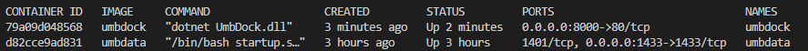

# Umbraco and Docker

## Prerequisites

In order to participate in this workshop you will need to ensure you have the full list of prerequisites, please see the [prerequisites](Prerequisites.md) document for details.

# Slides 

Before we start the next stages we will look at the following concepts. The link to the slides used throughout this presentation is https://docs.google.com/presentation/d/1Nn1hfFkZp8QWpCsnIAGMH6IdBk0R551CiuU3IiJpBdk/

# Tools and Set-up

During this workshop it is recommended that you use [Visual Studio Code](https://code.visualstudio.com/) to run the workshop, and that you have the Auto-save feature enabled. To do this, go to the **File** menu, and select **Autosave**.

Where commands are executed, you should be using the built in terminal from VS Code, and not the command line. To open the terminal, select **View**, then **Terminal**.

These instructions are also available on the [GitHub repository](https://github.com/CarlSargunar/Umbraco-Docker-Workshop/blob/main/Workshop.md) or your own fork.

Wherever there are something for you to do I will add the flag **Action:**. This will indicate to you that you should do the action described in the instruction.

During the workshop please take extra care to make sure you have the right path according to the instructions. There are a lot of similarly named files and folders, and you will need to be careful to not mix them up.

## Working Folder

**Action:** Create a folder in the root of your application called Workshop. In your terminal window, change directory to the **Workshop** directory. All exercises will be completed in this folder.

The folders which are in this workshop are : 

- **Files** - This folder contains pre-created files which will be used in this workshop to save you typing everything out manually
- **Media** - The images used in this workshop are stored in there
- **Workshop Complete** - This folder contains a fully complete version of the workshop which can be used for reference in case you run into problems, in a zipped up file. No cheating - you won't learn if you do, but it's a useful guide for reference if you get stuck 🙂 
- **Workshop** - This will be the active folder where the workshop is being run from, and all files you create and edit will be in this folder. 

## A Note on Windows vs Linux Line Endings

When you clone files onto windows the line endings may be checked out using the windows style CRLF (Carriage-Return, Line-Feed). For files which need to run on Linux based containers, you need to change this to LF (Line-Feed only). This can be done using the option as shown below.

If it shows CRLF, click on the label and at the top you can change it to LF.

*Note : Historically windows terminates line-endings in file with a carriage return and line feed (CRLF), while Linux uses a single line feed (LF) - and if you want to learn about the history of why then check out this awesome video from Scott Hanselman : [https://www.youtube.com/watch?v=TtiBhktB4Qg](https://www.youtube.com/watch?v=TtiBhktB4Qg)*

---

# Exercise 1 - Create a Database Container

The first task we will do is to create a database container which will be used to store the data for our Umbraco site.

## 1.1 Create a container for the database server

**Action:** 
- Create a new folder in your copy of the repostory called **Workshop**.
- Ensure your Visual Studio Code terminal is in the new **Workshop** folder.
- In your Workshop folder, create a new folder called **UmbData**. 
- In that folder, create a blank file in the UmbData folder called **Dockerfile**. 

This will folder and the associated Dockerfile will define the database container, the image to use, and the ports it exposes and also describe the configuration we will use with that database container. 

*Note : the casing of the file is important - it needs to be called Dockerfile with no extension*

**Action:** Paste the contents below in that file, and make sure the line endings are **LF**.

    FROM mcr.microsoft.com/azure-sql-edge:latest

    ENV ACCEPT_EULA=Y
    ENV SA_PASSWORD=SQL_password123

    USER root
    
    RUN mkdir /var/opt/sqlserver
    
    RUN chown mssql /var/opt/sqlserver
    
    ENV MSSQL_BACKUP_DIR="/var/opt/mssql"
    ENV MSSQL_DATA_DIR="/var/opt/mssql/data"
    ENV MSSQL_LOG_DIR="/var/opt/mssql/log"

    EXPOSE 1433/tcp

    # Copy Setup SQL script
    COPY setup.sql /
    COPY startup.sh /

    # Copy the database files to the container
    # NOTE : This is not a recommendation for production use as the database files should be stored in a persistent volume and not be a part of the image
    COPY Umbraco.mdf /var/opt/sqlserver
    COPY Umbraco_log.ldf /var/opt/sqlserver

    ENTRYPOINT [ "/bin/bash", "startup.sh" ]
    CMD [ "/opt/mssql/bin/sqlservr" ] 

This file will instruct Docker to create a SQL server running azure-sql-edge, will accept the End User License Agreement, and will define environmental variables to configure the paths to be used for databases. It will also configure the ports to be exposed (1433), and copy two scripts into the container. These scripts will be used to restore the database export from the container. 

*Note : We are use Azure SQL Edge here as a database container for compatibility - SQL Edge will with on both x64 as well as ARM cpus which come on Macbooks with an M1 chip.*

**Action:** : Copy the database setup scripts and databases

- From **/Files/UmbData/setup.sql** to **/Working/UmbData/setup.sql**
- From **/Files/UmbData/startup.sh** to **/Working/UmbData/startup.sh**
- From **/Working/UmbWeb/umbraco/Data/Umbraco_log.ldf** to **/Working/UmbData/Umbraco_log.ldf**
- From **/Working/UmbWeb/umbraco/Data/Umbraco.mdf** to **/Working/UmbData/Umbraco.mdf**

These two script files will be used to create a new database if none already exists when the database container starts. That way when the website starts it will already have a database ready to use, but if the database already exists it won't restore it.

**Action:** Once all these files exist in the Working/UmbData folder, make sure the **Dockerfile, setup.sql and startup.sh** have the correct line-endings, that they are terminated with Line Feed (LF) and NOT Carriage Return Line Feed (CRLF) (See earlier for details).

## 1.2 Build the database image and run the database container

All our files are ready to build the database image and run the database container, so that's the next step.

*Note : If you are running a local SQL Server on your machine, or any other process listening on port 1433, you will need to stop that process before you can run the database container, or the container will not be able to start.*

*Note : You need to ensure that you don't have a running SQL server on your host machine, as the port used will clash with your container. Stop any servers to ensure port 1433 is not in use.*

**Action:** 

Ensure you are in the **/Working** folder in your terminal window and build the database image with the following command:

    docker build --tag=umbdata ./UmbData    

Once the image is built, run it with the following command. 

    docker run --name umbdata -p 1433:1433 --volume sqlFiles:/var/opt/mssql  -d umbdata

This should give you a container ID back if the container was started successfully. You should also be able to see the container running in Docker Desktop.

## 1.3 Creating the network for our containers

Before we create website containers, we need to create a network to allow our containers to communicate. We will be using a [User Defined Bridge Network](https://docs.docker.com/network/bridge/) to let our containers communicate using container names. Without this, they would only be able to communicate with IP address. 

**Action:** Run the following command in the terminal window to create a new Bridge network for our containers to use. 

    docker network create -d bridge umbNet    

We then need to run the database and website containers attached to this network. Since the database container is already running, we can issue the following command to attach the container to the network.

    docker network connect umbNet umbdata

You can inspect the network by running the following command.

    docker network inspect umbNet

In the output you should see the umbdata container listed in the containers section.

### Connecting to the database container

To test that your container is running Ok, you may want to test connecting to the server. You can connect with any number of tools, e.g.Sql Server Management Studio, LinqPad, or the Visual Studio Code SQL Server extension using the following credentials : 

- Host : Localhost
- Username : sa
- Password : SQL_password123
- Port : 1433

# Exercise 2. Creating the basic Umbraco Site

We are going to create our Umbraco website running locally on your machine natively, and connected to the database container we just created.

## Installing Umbraco Template and start Website

**Action:** Install the Umbraco .NET Template.

    dotnet new install Umbraco.Templates::12.0.0-rc3 --force

## 2.1 Start a container to run the database

**Action:** Create a new Umbraco site using the following command. This will define the name of the site and the default database, as well as the default admin user and password. 

Here we will be using SQL LocalDB as the database so that in later steps it can be imported directly into the production database server. 

    dotnet new umbraco -n UmbWeb --friendly-name "Admin User" --email "admin@admin.com" --password "1234567890" --connection-string "Server=localhost;Database=UmbracoDb;User Id=sa;Password=SQL_password123;TrustServerCertificate=true"

If you are running this exercise on a Mac or Linux, you won't be able to run this site locally as it uses LocalDB, but instead will need to create your database container in step 2.2 and then run the site connecting to that image.

## 2.2 Install a template site for the exercise. 

This workshop will use the [standard starter kit for Umbraco](https://www.nuget.org/packages/Umbraco.TheStarterKit). This is a great starting point, and will let us focus on the docker integration while giving us a great site to work with, as well as a content structure which is suited to a headless API.

**Action:** Run the following command to install the Umbraco starter kit.

    dotnet add UmbWeb package Umbraco.TheStarterKit

**Action:** Run the website by issuing the following command. This will start the website using Kestrel, and connect to the database server in the container.

    dotnet run --project UmbWeb

This should, if there are no errors, start up the website for you to browse.

If you browse the site at https://localhost:11608 (or whatever port your computer reports - it may vary) you should be able to see the site running. You can also access the Umbraco backoffice at https://localhost:11608/umbraco using the credentials below.

- Username : admin@admin.com
- Password : 1234567890

## Exercise 3. Running the Umbraco Site in a container

Now that the Umbraco site is working, we need to create a container for it. While running in the container, the Umbraco site will connect to the database in the umbData container directly. 

If the site is still running, stop it by running by pressing **Ctrl + c** in the terminal window. 

## 3.1 Create the Umbraco Site container

**Action:** In the **UmbWeb** folder create a Dockerfile to define the components of the Umbraco container. Paste the contents below in that file, and make sure the line endings are **LF**. 

    # Use the SDK image to build and publish the website
    FROM mcr.microsoft.com/dotnet/sdk:7.0 AS build
    WORKDIR /src
    COPY ["UmbWeb.csproj", "."]
    RUN dotnet restore "UmbWeb.csproj"
    COPY . .
    RUN dotnet publish "UmbWeb.csproj" -c Release -o /app/publish

    # Copy the published output to the final running image
    FROM mcr.microsoft.com/dotnet/aspnet:7.0 AS final 
    WORKDIR /app

    # Copy the published output to the final running image
    COPY --from=build /app/publish .

    # Copy the media items to the final running image
    COPY ./wwwroot/media ./wwwroot/media

    # Set the entrypoint to the web application
    ENTRYPOINT ["dotnet", "UmbWeb.dll"]

This Dockerfile starts with a build image which contains the SDK to actually compile the project, and one with ASP.NET runtimes to actually host the running application. The running application doesn't need any build tools, so we don't include them. From the above Dockerfile we can see the stages of the build process.

1. Starting on the main image, we will use the SDK image to compile the project.
2. Copying the working project folder to the build image
3. Run the restore command to download the dependencies
4. Compile and publish the output of the project
5. Switch to the hosting image 
6. Copy the published output to the final image
7. Copy the media files to the final image
8. Set the entrypoint to the binary output of the main project

## 3.2 Building the Umbraco Site image, setting a network and running it

Once the Dockerfile exists, we need to create a configuration which lets the website contianer connect to the database container. 

**Action:** Create a copy of the **appsettings.Development.json** called **appsettings.Staging.json**. In that file ensure the connectionstring is set-up to connect to **umbdata** as the database server. You will need to add the following connectionstring section to the file as a sibling of the Umbraco node. 

    "ConnectionStrings": {
        "umbracoDbDSN": "Server=umbdata;Database=UmbracoDb;User Id=sa;Password=SQL_password123;TrustServerCertificate=true",     "umbracoDbDSN_ProviderName": "Microsoft.Data.SqlClient"
    }

You could altenatively copy the already edited from from the **/Files/UmbWeb/appsettings.Staging.json** file in the repository.

Finally we can compile a docker image for the Umbraco site. 

**Action:** Run the following command to build the image.

    docker build --tag=umbweb ./UmbWeb

This will download the required components and compile a final image ready to run the site in a container, and may take some time. 

At this point we can see all the images we have created by using the following command

    docker images

## 3.3 Running the website container in the same network

We can then run the website container. *Notice in the command below there is an argument to let the container know which network to connect to - the same **umbNet** network*. Here we are doing this using the **docker run --network** flag instead of using an explicit command.

**Action:** Run the following command to run the website container.

    docker run --name umbweb -p 8000:80 -v umb_media:/app/wwwroot/media -v umb_logs:/app/umbraco/Logs -e ASPNETCORE_ENVIRONMENT='Staging' --network=umbNet -d umbweb

In the above command you can also see the volumes we use with the application container - specifically the log and the media folders. The reason to use these is that with media we want to share the media library if we should want to create more running sites (as we will later in the course) and with logs, we want to be able to view these logs and diagnose issues if the container isn't able to run for any reason.

Similarly with media, we want all website containers to be able to share the same media library, so we can use a volume for this so the images are stored on the docker host and not in the container.

One other thing we can see is the Environment variable we are passing the container with the -e flag, which sets our AspNetCore Environment to staging, and thus causes the container to run with the appsettings.staging.json file and allow us to connect to the database.

You can now see the website running by visiting:
    
    http://localhost:8000

Once the container is running, if you run a docker ps command, you'll see both the database and website containers running.

    docker ps

You can also see the status of running containers and logs by running the Docker Desktop application.

## Additional Reading - Networks and Volumes

Docker networks and volumes won't be covered in depth during this workshop as it's time-limited, but if you wish to read further, the following links may be useful.

- [Docker Networks](https://docs.docker.com/network/)
- [Docker Volumes](https://docs.docker.com/storage/volumes/)

# Exercise 4. Adding an API to the site

We will use the new Umbraco 12 Content Delivery API to add an API to the site.

## 4.1 - Build Index for Content API

Now that there is a site and database running, we will use the new content delivery API. First we need to enable the API by adding the following to appsettings.json under Umbraco > CMS

    "DeliveryApi": {
            "Enabled": true,
            "RichTextOutputAsJson": false
    }

## 4.2 - Enable CORS Policy to allow access to the API

We will also need to enable CORS to allow access to the API. To do this, we will add the following to the Configure method in Startup.cs

    public void ConfigureServices(IServiceCollection services)
    {
        services.AddCors(policy =>
            {
                policy.AddPolicy("CorsPolicy", opt => opt
                    .AllowAnyOrigin()
                    .AllowAnyHeader()
                    .AllowAnyMethod());
            });

        services.AddUmbraco(_env, _config)
            .AddBackOffice()
            .AddWebsite()
            .AddDeliveryApi()
            .AddComposers()
            .Build();
    }

You will also need to start that CORS Policy in the Startup.cs Configure method

    public void Configure(IApplicationBuilder app, IWebHostEnvironment env)
    {
        if (env.IsDevelopment())
        {
            app.UseDeveloperExceptionPage();
        }

        app.UseCors("CorsPolicy");

        app.UseUmbraco()
            .WithMiddleware(u =>
            {
                u.UseBackOffice();
                u.UseWebsite();
            })
            .WithEndpoints(u =>
            {
                u.UseInstallerEndpoints();
                u.UseBackOfficeEndpoints();
                u.UseWebsiteEndpoints();
            });
    }

## 4.3 - Rebuild the image and run it

You will need to rebuild the umbWeb docker image and run it again to see the changes. You can use the following to do that

    docker build --tag=umbweb ./UmbWeb

Stop and remove the previous running umbweb container

    docker stop umbweb
    docker rm umbweb

Run the new version of the umbweb image

    docker run --name umbweb -p 8000:80 -v umb_media:/app/wwwroot/media -v umb_logs:/app/umbraco/Logs -e ASPNETCORE_ENVIRONMENT='Staging' --network=umbNet -d umbweb
    

## 4.4 - Rebuild the Index and test the API

You will need to log in to Umbraco and rebuild the index to ensure the API is working. You can do this by going to the following url:

    http://localhost:8000/umbraco

Use the credentials below :

    Username : admin@admin.com
    Password : 1234567890

You can then navitage to Settings > Examine Management > DeliveryApiContentIndex and rebuild that index.

Open the site at the url http://localhost:8000/umbraco/swagger/index.html and in the top dropdown, select the "Umbraco Delivery API". You should be able to test the content API to ensure it is working.

If you'd like to see more info about the Content delivery API, please read the docs : [https://docs.umbraco.com/umbraco-cms/v/12.latest/reference/content-delivery-api](https://docs.umbraco.com/umbraco-cms/v/12.latest/reference/content-delivery-api)

## Testing the Product API

To test the API, you can simply call a url like the following url, which returns all documents of type "Product":

    http://localhost:8000/umbraco/delivery/api/v1/content?filter=contenttype%3Aproduct

This should return a JSON collection of Post Summaries in a collection, which we will use with the Blazor App.

## 4.5 Running a 2nd instance of the website container

While the website container has the API running, we want to spin up a 2nd instance of the website container. This will simulate a load-balanced environment. 

*Note : By using the same volumes for media and logs, both containers will share the storage on the docker host, and thus the media library and logs will be shared between the containers. However this is NOT enough to run a load balanced container in production - this is to separate the content entry and content delivery nodes in this demo.*

**Action:** Run the following command to start the 2nd container.

    docker run --name umbweb2 -p 8001:80 -v umb_media:/app/wwwroot/media -v umb_logs:/app/umbraco/Logs -e ASPNETCORE_ENVIRONMENT='Staging' --network=umbNet -d umbweb 

You can browse this container by visiting the following URL:

    http://localhost:8001/

With multiple website containers running, your Docker Desktop instance will look similar to the following:

# 5 Add the Blazor Container

We will now create a final container which will be used to run a blazor app, connect to the Blog summary API and show a summary of posts.

## 5.1 Create the Blazor App and show the blog summaries

**Action:** Start a new Blazor WASM project by running the following:

    dotnet new blazorwasm --name UmBlazor

**Action:** Copy the following whole folders from the /Files/UmbWeb folder to the /Workshop/UmbWeb folder.

- **/Files/UmBlazor/Models** to **/Workshop/UmBlazor/Models**
- **/Files/UmBlazor/Pages/FetchData.razor** to **/Workshop/UmBlazor/Pages/FetchData.razor**
- **/Files/UmBlazor/wwwroot/appsettings.json** to **/Workshop/UmBlazor/wwwroot/appsettings.json**

**Action:** Test that the application works by running the following command in your terminal:

    dotnet run --project UmBlazor
    
Ignoring any warnings, you should be able to browse the WASM site using the relevant output URL

In my case I can use https://localhost:7025. This will bring up a site, and the Fetch Data page should show the blog summaries from the Umbraco site.

## 5.2 Create the Blazor Container

To run the Blazor WASM app in a container, it's a little different to running an Umbraco website. The Umbraco site needs to run Kestrel as a webserver, but Blazor WASM just needs to serve files. As such it will use nginx to serve these pages on the container. 

I've created the Dockerfile and nginx configuration file, these need to be copied to the project folder.

**Action:** Copy the following:

- **/Files/UmBlazor/Dockerfile** to **/Workshop/UmBlazor/Dockerfile**
- **/Files/UmBlazor/nginx.conf** to **/Workshop/UmBlazor/nginx.conf**

*Note : Don't copy the other files yet*

Looking at the contents of the Dockerfile : 

    FROM mcr.microsoft.com/dotnet/sdk:7.0 AS build
    WORKDIR /src
    COPY UmBlazor.csproj .
    RUN dotnet restore UmBlazor.csproj
    COPY . .
    RUN dotnet build UmBlazor.csproj -c Release -o /app/build

    FROM build AS publish
    RUN dotnet publish UmBlazor.csproj -c Release -o /app/publish

    FROM nginx:alpine AS final
    WORKDIR /usr/share/nginx/html
    COPY --from=publish /app/publish/wwwroot .
    COPY nginx.conf /etc/nginx/nginx.conf

We can see that this container is using the nginx image, and rather than starting the application, it merely hosts the published output of the UmBlazor project. 

### Build Image and run the container

Next we can build the Blazor Image using the following command:

**Action:** Run the following command to build the image.

    docker build --tag=umblazor .\UmBlazor    

Once that's done, we can run the Container

**Action:** Run the following command to start the container.

    docker run --name umblazor -p 8002:80 --network=umbNet -d umblazor

Now the site could be browsed using the containter using the url

    http://localhost:8002/

Upon running the site we should see the same Blazor app from the earlier example, but this time running from the container instance, and when it queries the rest API to load blog content, it is doing so from the content delivery container.

# 6 Docker compose

So far we have created all our containers manually which is fine, but we want to make this repeatable. In this part we will use Docker compose to deploy all containers together, and to configure the network between them. This will use the Production profiles of the various projects.

Docker compose is a tool for defining and running multi-contianer applications including :

- Names of each of the containers (called Services in Docker compose)
- The networks each container connects to
- The volumes used by each container
- The ports exposed by each container
- Environmental variables configured for each container

This single file represents the entire application, and can be used to deploy the application to any environment.

## 6.1 Create the Docker Compose file

I've prepared a single docker compose file to complete this application To prepare the application for deployment with Docker compose:

**Action:** Copy the following files:

- Copy **/Files/docker-compose.yml** to **/Workshop/docker-compose.yml**
- Copy **/Files/UmbWeb/appsettings.Production.json** to **/Workshop/UmbWeb/appsettings.Production.json**
- Copy **/Files/UmBlazor/wwwroot/appsettings.Production.json** to **/Workshop/UmBlazor/wwwroot/appsettings.Production.json**

## 6.2 Run the Docker Compose file

Finally before we run, we need to delete all existing running containers. 

**Action :** Run the following command in your terminal:

    docker rm -f umblazor umbweb umbweb2 umbdata

Verify that none are running by looking at the Docker Desktop app, or by running the 'docker ps' command. Once all running containers have been deleted, we can run the Docker Compose file.

**Action :** Start all contaiers using the following command:

    docker compose up -d

This will first buuld and then start all the containers from the images we have just built, and if you open Docker Desktop, you should see all the containers running.

Once these are up, we can browse the umbraco websites using the following URLs

- Umbraco 1 : http://localhost:5080/ 
- Umbraco 2 : http://localhost:5081/
- Blazor : http://localhost:5082/

To stop and remove the containers, run the following command:

    docker-compose down 

# References

## Umbraco

There is a great tool to help you configure the the unattended installation options for umbraco at [https://psw.codeshare.co.uk/](https://psw.codeshare.co.uk/)

## Troubleshooting 

Trust the Dev Certs

    dotnet dev-certs https --trust

Clear your local nuget cache

    dotnet nuget locals all --clear

